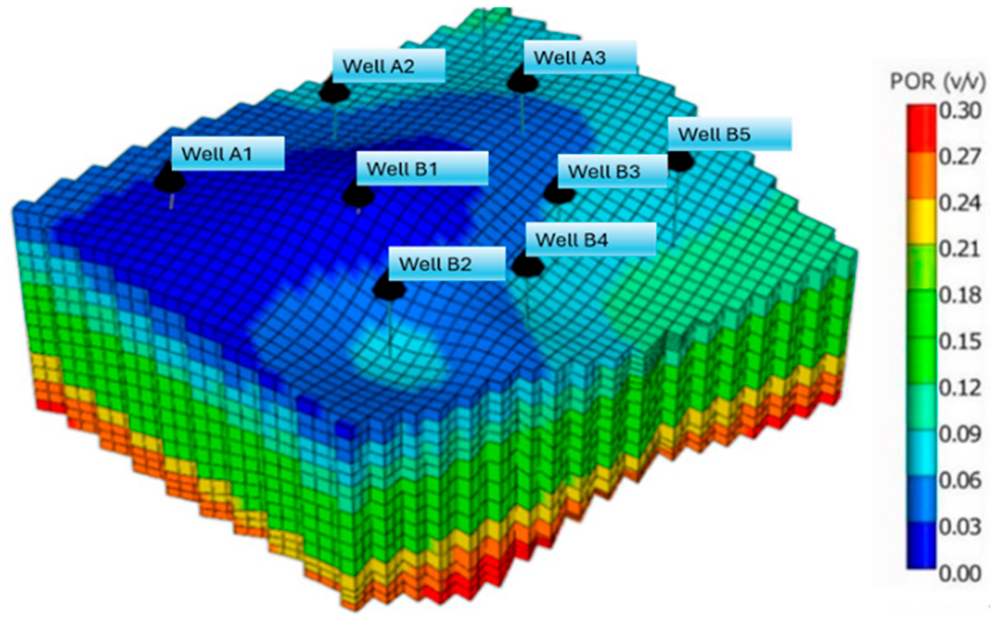

# Computational Petroleum Engineering Lab



A growing collection of petroleum engineering simulators, numerical solvers, and physics-based engineering tools built from first principles.

This repository documents my journey from studying numerical methods to applying them in real oil & gas engineering systems — including reservoir simulation, drilling mechanics, production modeling, and field optimization.

---

## 🎯 Objective

To bridge the gap between:

• Mathematical theory
• Numerical analysis
• Petroleum engineering physics
• Practical industry tools

Each module in this lab converts a numerical method into a working engineering simulator.

---

## 🧠 Core Focus Areas

* Linear Algebra in Reservoir Flow Modeling
* Nonlinear Solvers for PVT & Production Systems
* Numerical Integration for Volumetrics
* Optimization in Field Development Planning
* ODE Models for Production Forecasting
* PDE-Based Reservoir Simulation
* Monte Carlo Risk & Reserve Estimation

---

## 🛠️ Tool Modules

| Module                 | Engineering Application     | Status         |
| ---------------------- | --------------------------- | -------------- |
| Well Rate Solver       | Multi-well flow allocation  | 🟢 Active      |
| Bubble Point Solver    | PVT modeling                | 🟢 Active      |
| STOIIP Calculator      | Reserve estimation          | 🟡 In Progress |
| Decline Curve Engine   | Production forecasting      | 🟡 In Progress |
| 1D Reservoir Simulator | Pressure diffusion modeling | 🔵 Planned     |

---

## 📁 Repository Structure

```
├── linear-algebra/
│   ├── well-rate-solver
│   └── nodal-analysis-matrix
├── interpolation/
│   ├── pvt-interpolator
│   └── well-log-reconstructor
├── root-finding/
│   ├── bubble-point-solver
│   └── z-factor-calculator
├── integration/
│   └── stoiip-calculator
├── optimization/
│   └── well-placement-optimizer
├── ode-simulators/
│   ├── material-balance-simulator
│   └── decline-curve-engine
├── pde-simulators/
│   ├── 1d-reservoir-simulator
│   └── waterflood-model
└── monte-carlo/
    └── reserve-risk-simulator
```

---

## 🧪 Tech Stack

* Python (NumPy, SciPy, Matplotlib)
* MATLAB
* C++ (Numerical algorithms)
* Plotly / Dash (Visualization)
* Streamlit (App UI)

---

## 📚 Knowledge Backbone

Key references driving this work include:

* Numerical Recipes: The Art of Scientific Computing
* Reservoir Simulation Fundamentals
* Applied Petroleum Reservoir Engineering

---

## 🚀 Vision

To develop a full suite of open, educational petroleum engineering simulators that make subsurface physics more visual, computational, and accessible.

---

## 🤝 Connect With Me

**Johnpaul Okeke**
Petroleum & Gas Engineering | Computational Simulation
LinkedIn: https://www.linkedin.com/in/okeke-johnpaul-659685173/
Email: okekejohnpaul12@gmail.com
